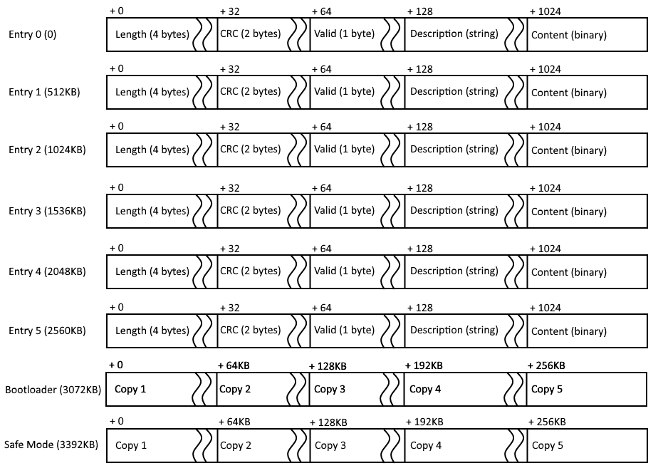

# Boot table 

## Boot table layout
Boot table is placed on external program flash on OBC board (S29JL 4MB NOR flash). It is divided into 6 **entries** 512KB each. Each entry consists of:
 1. Size in bytes (32-bit)
 2. CRC checksum (16-bit)
 3. Valid flag (8-bit)
 4. Description (Variable length up to 896 bytes, null-terminated string)
 5. Program content (Of size stored in *Size* field - up to 511KB)
 
After all entries 5 copies of bootloader are stored (64KB each).
 
Flash layout is presented on image below:
